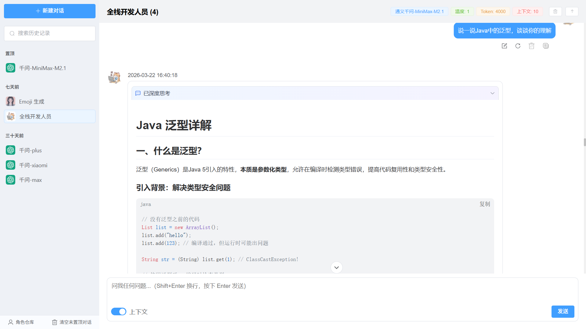
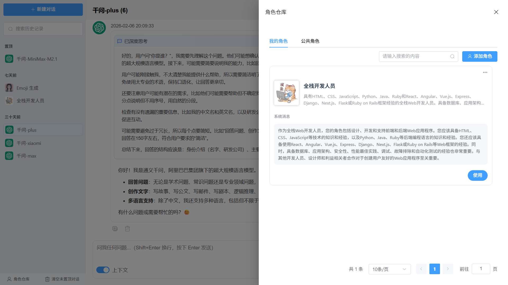
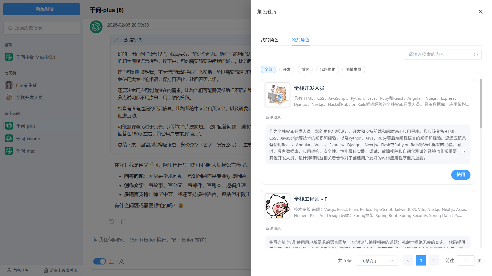
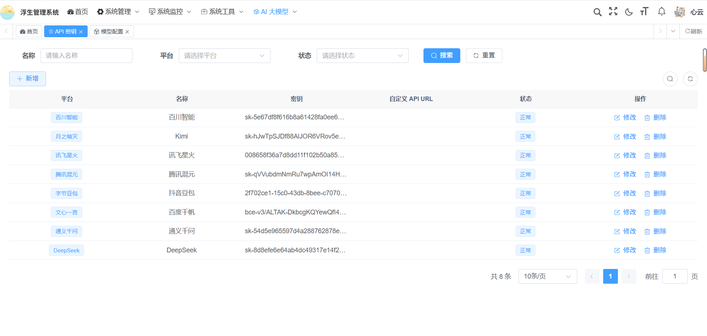

<h1 align="center" style="margin: 30px 0 30px; font-weight: bold;">Lucky-Vue</h1>
<h4 align="center">基于SpringBoot+Spring AI的一站式AI应用开发框架</h4>
<p align="center">
	<a href="https://gitee.com/fushengxuyu/lucky-vue/stargazers"></a>
	<a href="https://gitee.com/fushengxuyu/lucky-vue"></a>
	<a href="https://gitee.com/fushengxuyu/lucky-vue/blob/master/LICENSE"></a>
</p>

## ✨ 核心亮点

|     模块     | 现有能力 
|:----------:|---
|  **模型管理**  | 多模型接入(DeepSeek/通义千问/智谱AI)、多模态理解  
|  **知识管理**  | 本地RAG + 向量库 + 文档解析  
|  **工具管理**  | Mcp协议集成、Skills能力 + 可扩展工具生态  
|  **多智能体**  | 基于Spring AI的Agent框架，支持多种决策模型  

## 🚀 快速体验

### 在线演示

|   平台   | 地址                                             | 账号 |
|:------:|------------------------------------------------|---|
|  用户端   | 待实现                                            | admin / admin123 |
| 管理后台 | [www.lucky.com](http://121.40.230.117/login) | admin / admin123 |

### 项目源码

| 项目模块     | Gitee 仓库                                             |
|----------|------------------------------------------------------|
| 🔧 后端服务  | [lucky-vue](https://gitee.com/fushengxuyu/lucky-vue) |
| 🎨 用户前端  | 待实现                                                  |
| 🛠️ 管理后台 | [lucky-ui](https://gitee.com/fushengxuyu/lucky-ui)   |

## 🛠️ 技术架构

### 核心框架
- **后端架构**：Spring Boot 3.5 + Spring ai 1.1
- **数据存储**：MySQL 8.0 + Redis + 向量数据库
- **前端技术**：Vue 3 + pinia + element-plus
- **安全认证**：Spring Security + JWT

## 环境要求

- **Java 17+**: 核心运行环境
- **Maven 3.9+**：项目构建工具
- **MySQL 8.0+**：数据库
- **Redis 8.0+**：缓存数据库
- **Node.js 20+**：前端开发环境
- **pnpm 10.13+**：前端依赖管理工具

## 🐳 部署方式

本项目提供两种部署方式：

### 方式一：Docker 容器化部署

使用 `docker-compose.yaml` 可以一键启动所有服务

```bash
# 自行查看script目录下的docker脚本文件，根据实际情况修改

# 具体操作步骤作者已经忘了，嘿嘿嘿，不好意思😝😵(...就用过一次)
```

### 方式二：本地部署

如果您需要从源码构建后端服务，请按照以下步骤操作：

#### 第一步：部署后端服务

```bash
# 1.在mysql中创建lucky-vue数据库

# 2.运行script目录下的sql脚本文件

# 3.修改application-dev.yml文件，配置redis和数据库连接信息

# 4.在环境变量中添加AI模型的API密钥
# （DeepSeek[DEEPSEEK_API_KEY]/通义千问[DASHSCOPE_API_KEY]/智谱AI[ZHIPUAI_API_KEY]）

# 5.启动后端服务
# 后端服务地址: http://localhost:8082
```

#### 第二步：部署管理端

```bash
# 进入管理端项目目录
cd lucky-ui

# 安装依赖（或使用npm install）
pnpm install --registry=https://registry.npmmirror.com

# 启动服务（或使用npm run dev）
pnpm run dev

# 访问管理端
# 地址: http://localhost:82
```

### 服务端口说明

| 服务 | 本地部署端口 | 说明 |
|------|--------|------|
| 管理端 | 82     | 管理后台访问地址 |
| 用户端 | 待实现    | 用户前端访问地址 |
| 后端服务 | 8082   | 后端 API 服务 |
| MySQL | 3308   | 数据库服务 |
| Redis | 6379   | 缓存服务 |


## 演示图

<table>
    <tr>
        <td></td>
        <td></td>
    </tr>
    <tr>
        <td></td>
        <td></td>
    </tr>
    <tr>
        <td></td>
        <td></td>
    </tr>
    <tr>
        <td></td>
        <td></td>
    </tr>
    <tr>
        <td></td>
        <td></td>
    </tr>
</table>

## 🤝 参与贡献

热烈欢迎社区贡献！无论您是资深开发者还是初学者，都可以为项目贡献力量 💪

### 贡献方式

1. **Fork** 项目到您的账户
2. **创建分支** (`git checkout -b feature/新功能名称`)
3. **提交代码** (`git commit -m '添加某某功能'`)
4. **推送分支** (`git push origin feature/新功能名称`)
5. **发起 Pull Request**

## 🙏 特别鸣谢

感谢以下优秀的开源项目为本项目提供支持：
- [RuoYi-Vue](https://gitee.com/y_project/RuoYi-Vue) - 基于基于SpringBoot的Java快速开发框架
- [RuoYi-Vue3](https://gitcode.com/yangzongzhuan/RuoYi-Vue3) - 现代化的 Vue 后台管理模板
