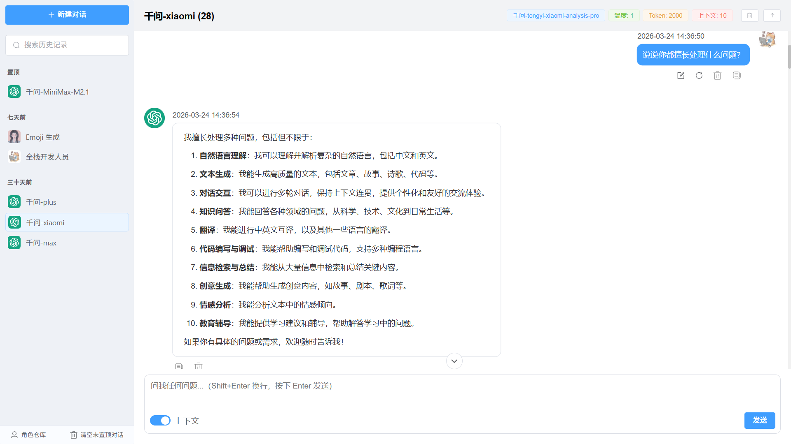
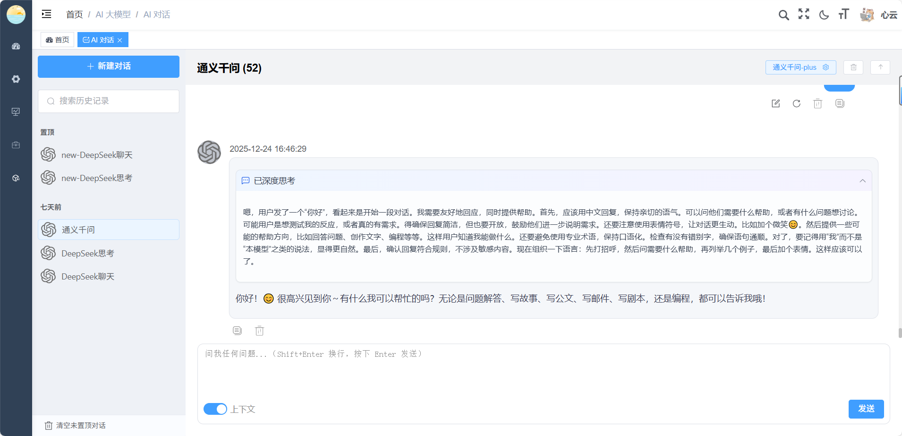
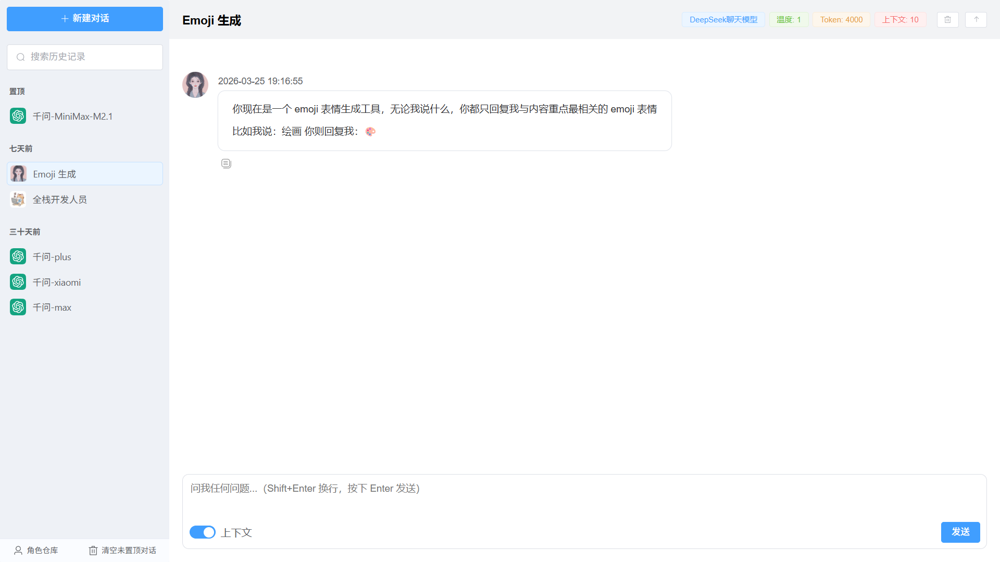
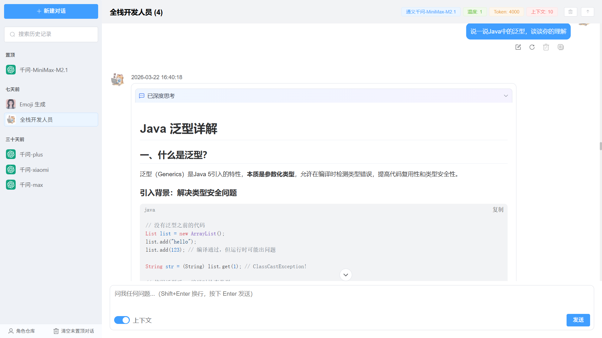
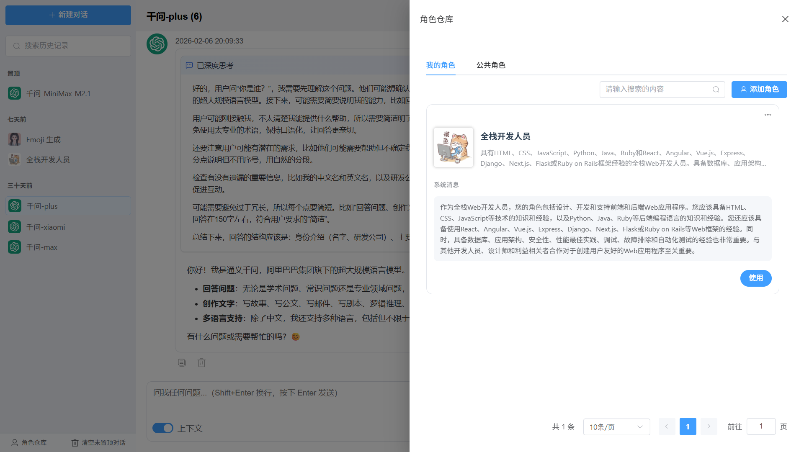
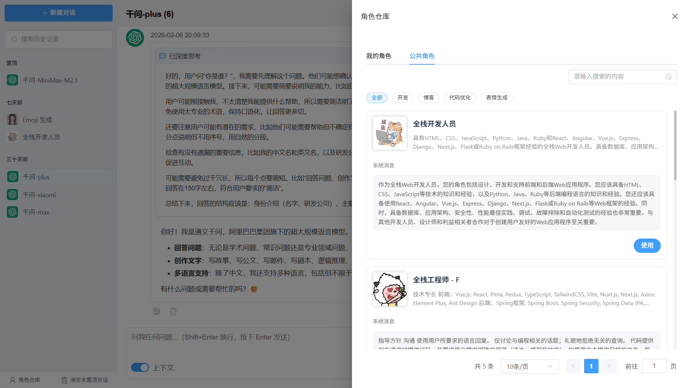
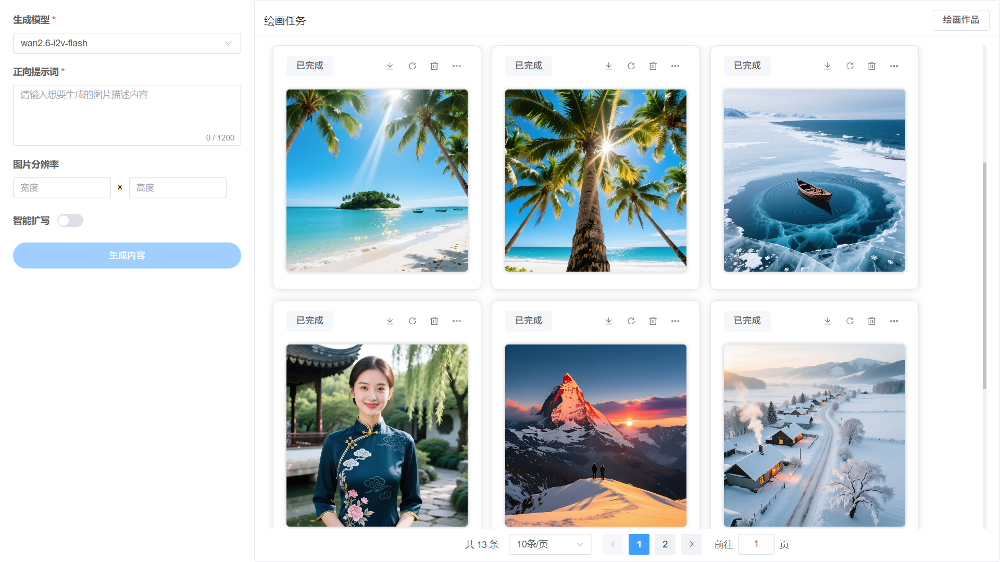
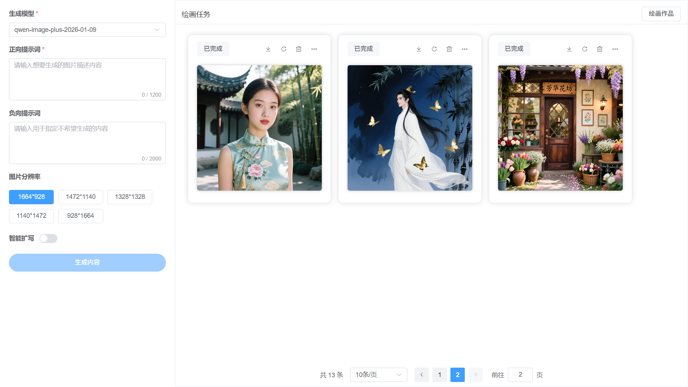
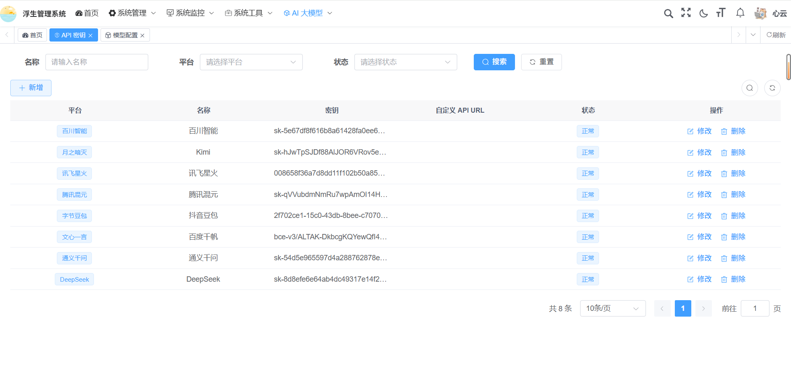
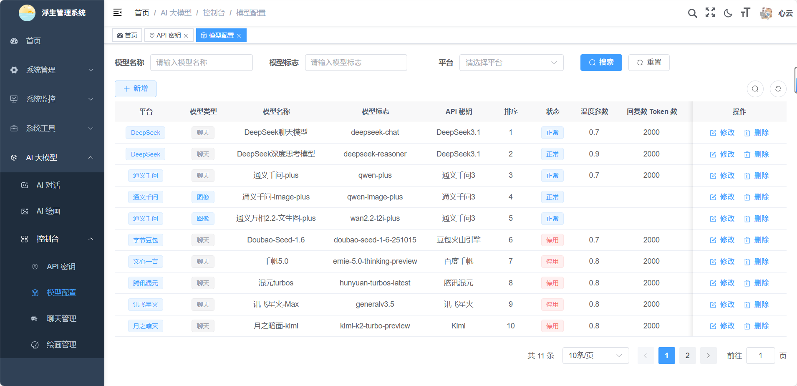

<h1 align="center" style="margin: 30px 0 30px; font-weight: bold;">Lucky-Vue</h1>
<h4 align="center">基于SpringBoot + Spring AI 的一站式AI应用开发框架</h4>
<p align="center">
	<a href="https://gitee.com/fushengxuyu/lucky-vue/stargazers"></a>
	<a href="https://gitee.com/fushengxuyu/lucky-vue"></a>
	<a href="https://gitee.com/fushengxuyu/lucky-vue/blob/master/LICENSE"></a>
</p>

## ✨ 核心亮点

|     模块     | 现有能力 
|:----------:|---
|  **模型管理**  | 多模型接入(DeepSeek/通义千问/智谱AI)、多模态理解  
|  **知识管理**  | 本地RAG + 向量库 + 文档解析  
|  **工具管理**  | Mcp协议集成、Skills能力 + 可扩展工具生态  
|  **多智能体**  | 基于Spring AI的Agent框架，支持多种决策模型  

## 🚀 快速体验

### 在线演示

|   平台   | 地址  | 账号 |
|:------:|-----|---|
|  用户端   | 待实现 | admin / admin123 |
| 管理后台 | 暂无  | admin / admin123 |

### 项目源码

| 项目模块     | GitHub 仓库                                          | Gitee 仓库                                             | GitCode 仓库                                             |
|----------|----------------------------------------------------|------------------------------------------------------|--------------------------------------------------------|
| 🔧 后端服务  | [lucky-vue](https://github.com/shengxia21/Lucky-Vue.git)   | [lucky-vue](https://gitee.com/fushengxuyu/lucky-vue.git)       | [lucky-vue](https://gitcode.com/qq_56585325/lucky-vue.git)       |
| 🎨 用户前端  | 待实现                                                | 待实现     | 待实现     |
| 🛠️ 管理后台 | [lucky-admin](https://github.com/shengxia21/Lucky-admin.git) | [lucky-admin](https://gitee.com/fushengxuyu/lucky-admin.git) | [lucky-admin](https://gitcode.com/qq_56585325/lucky-admin.git) |

### 框架与 RuoYi 的功能差异

| 功能          | 改进                                                                                                             |
|-------------|----------------------------------------------------------------------------------------------------------------|
| 后端项目结构      | pom模块解耦 易于扩展                                                                                                   |
| Web容器       | 采用 Undertow 基于 XNIO 的高性能容器                                                                                     |
| 权限认证        | 采用 Sa-Token、Jwt 静态使用功能齐全 低耦合 高扩展                                                                               |
| 权限注解        | 采用 Sa-Token 支持注解 登录校验、角色校验、权限校验、二级认证校验、HttpBasic校验、忽略校验<br/>角色与权限校验支持多种条件 如 `AND` `OR` 或 `权限 OR 角色` 等复杂表达式     |
| Redis客户端    | 采用 Redisson Redis官方推荐 基于Netty的客户端工具<br/>支持Redis 大部分命令 底层优化规避很多不正确的用法 例如: keys被转换为scan<br/>支持单机、哨兵、单主集群、多主集群等模式 |
| ORM框架       | 采用 Mybatis-Plus 基于对象操作, 告别单表查询还要写SQL的骚操作，实现全java操作且功能强大插件众多                                                    |
| 数据分页        | 采用 Mybatis-Plus 分页插件<br/>框架对其进行了扩展 分页对象 支持多种方式传参 支持前端排序 复杂排序                                                   |
| 数据权限        | 采用 Mybatis-Plus 插件 自行分析拼接SQL 无感式过滤<br/>只需为Mapper设置好注解条件 支持多种自定义 不限于部门角色                                        |
| 数据翻译        | 采用 easy-trans 注解, 告别部分需要通过id主键的形式联表操作                                                                          |
| 多数据源框架      | 采用 dynamic-datasource 支持市面大部分数据库<br/>通过yml配置即可动态管理异构不同种类的数据库                                                   |
| 多数据源事务      | 采用 dynamic-datasource 支持多数据源不同种类的数据库事务回滚                                                                       |
| 数据库连接池      | 采用 HikariCP Spring官方内置连接池 配置简单 以性能与稳定性闻名天下                                                                     |
| 数据库主键       | 采用 雪花ID 基于时间戳的 有序增长 唯一ID 再也不用为分库分表 数据合并主键冲突重复而发愁                                                               |
| 序列化         | 采用 Jackson Spring官方内置序列化 更安全且稳定                                                                                |
| 部署方式        | 支持 Docker 编排 一键搭建所有环境 让开发人员从此不再为搭建环境而烦恼                                                                        |

## 🛠️ 技术架构

### 核心框架
- **后端架构**：Spring Boot 3.5 + Spring AI
- **数据存储**：MySQL 8.0 + Redis + 向量数据库
- **前端技术**：Vue 3 + pinia + element-plus
- **安全认证**：Sa-Token + JWT 双重保障
- **实时通信**：SSE流式响应

## 环境要求

- **Java 17+**: 核心运行环境
- **Maven 3.9+**：项目构建工具
- **MySQL 8.0+**：数据库
- **Redis 8.0+**：缓存数据库

## 🐳 部署方式

本项目提供两种部署方式：

### 方式一：Docker 容器化部署

使用 `docker-compose.yaml` 可以一键启动所有服务

```bash
# 需自行查看script目录下的docker脚本文件，并根据实际情况修改
```

### 方式二：本地部署

如果您需要从源码构建后端服务，请按照以下步骤操作：

#### 第一步：部署后端服务

```bash
# 1.在mysql中创建lucky-vue数据库

# 2.运行script目录下的sql脚本文件

# 3.修改application-dev.yml文件，配置redis和数据库连接信息

# 4.启动后端服务
# 后端服务地址: http://localhost:8082
```

#### 第二步：部署管理端

```bash
# 进入管理端项目目录
cd lucky-admin

# 安装依赖（或使用npm install）
pnpm install --registry=https://registry.npmmirror.com

# 启动服务（或使用npm run dev）
pnpm run dev

# 访问管理端
# 地址: http://localhost:82
```

### 服务端口说明

| 服务 | 本地部署端口 | 说明 |
|------|--------|------|
| 管理端 | 82     | 管理后台访问地址 |
| 用户端 | 待实现    | 用户前端访问地址 |
| 后端服务 | 8082   | 后端 API 服务 |
| MySQL | 3308   | 数据库服务 |
| Redis | 6379   | 缓存服务 |

## 🤝 参与贡献

热烈欢迎社区贡献！无论您是资深开发者还是初学者，都可以为项目贡献力量 💪

### 贡献方式

1. **Fork** 项目到您的账户
2. **创建分支** (`git checkout -b feature/新功能名称`)
3. **提交代码** (`git commit -m '添加某某功能'`)
4. **推送分支** (`git push origin feature/新功能名称`)
5. **发起 Pull Request**

## 演示图

<table>
    <tr>
        <td></td>
        <td></td>
    </tr>
    <tr>
        <td></td>
        <td></td>
    </tr>
    <tr>
        <td></td>
        <td></td>
    </tr>
    <tr>
        <td></td>
        <td></td>
    </tr>
    <tr>
        <td></td>
        <td></td>
    </tr>
</table>

## 🙏 特别鸣谢

感谢以下优秀的开源项目为本项目提供支持：
- [RuoYi-Vue](https://gitee.com/y_project/RuoYi-Vue) - 基于SpringBoot的Java快速开发框架
